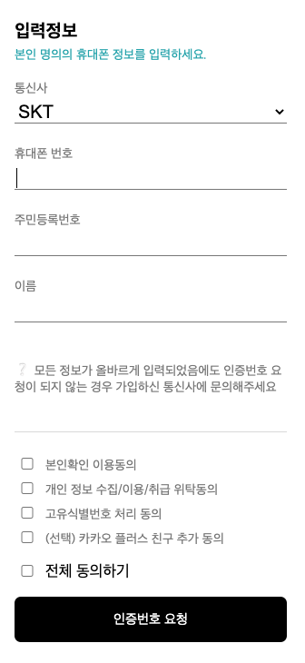

# 실행 
    - 개발시 npm 대신 yarn을 사용하였습니다.
1. init: yarn install
2. 실행: yarn start
3. 빌드: yarn build

# 해결 젼략

1. dom selector를 사용하지 않고 객체로 구현 : ( /ui/component/** )
    - id나 class에 영향받지 않도록 구현 -> 각자 컴포넌트에서만 이벤트 집중
        i. 무효값 체크시 각자의 컴포넌트에 영향주지 않음
        ii. checkbox에 전체 동의하기 클릭시 같은 checkbox들에게만 이벤트 발생 시킴
    - 서로 다른 객체에게 이벤트 등의 영향을 주지 않도록 구현
    - 반복되는 코드의 최소화
    
2. 입력정보(인증정보)를 class로 선언 : ( IdentityModel )
    - 원하는 정보(변수)만 전달하도록 설
    - static 한 값으로 선언하여 각자의 컴포넌트에서도 같은 객체를을 수정하도록 구현
    - 같은 객채를 다루는 함수를 한곳에 집중
        i. 인증정보의 빈값, 무효값 확인 하는 로직을 같은 곳에 구현
        ii. 같은 객체 안에 있어 효값 확인하기 위해 접근이 용이
        
3. 필수값 체크 
    - 휴대폰 번호
        i. 텍스트 타입 : 숫자
        ii. 시작번호 01 
        iii. 10자리 및 11자리
    - 주민등록번호
        i. 텍스트 타입 : 숫자
        ii. 성별 번호 1,2,3,4 
    - 이름
        i. 텍스트 타입 : 한글
        ii. 2글자 이상 (성 + 이름 최소 2자)
        iii. 10글지 이하
    - 약관
        i. 필수 약관
        
4. 데이터 변형 최소화
    - 위의 2.와 같이 model을 class 사용
    - list형 데이터의 값이 변형되지 않도록 Object.freeze() 사용
        ex) [통신사 목록(carrierList.js), 약관 목록(termsList.js), 인증목록(identityKey.js)] 
        
5. 주석 처리된 안내 log 및 alert
    - SubmitButton.js 
        i. line: 12 -> 부적합한 값 출력 log
        ii. line: 15 -> 빈값 안내 alert